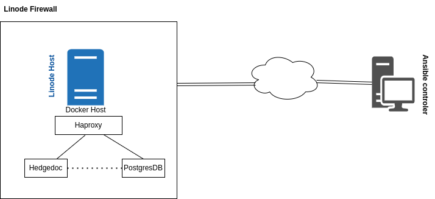
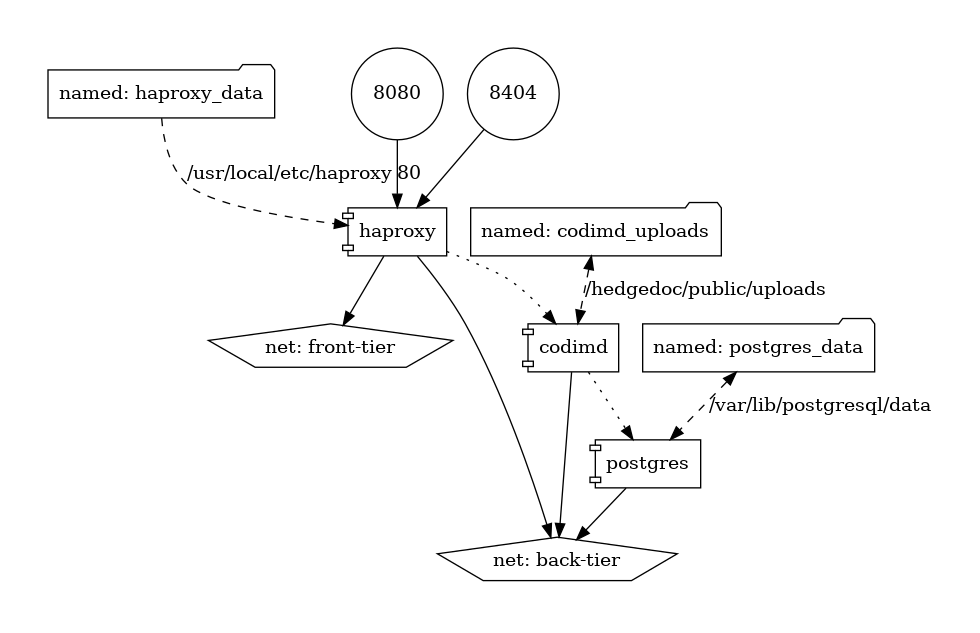

# Deploying apps on my Linode

After learninng new things on docker and ansible, I thought I should put into practice my little knowledge.
The idea here is to be able to deploy on my Linode machine, docker containers using Ansible.
I want to have some sort of cluster, a simple infrastructure to start. The ability to update my setup without touching the data already created
and used. Since I'm more confortable with diagrams, this is what setup looks like:

 <br>
*Simplified diagram of the setup.*

We can also visualize the setup using docker-compose-viz from PMSIpilot. To do this we can run the following command in the same folder as docker-compose.yml file:
```bash
docker run --rm -it --name dcv -v $(pwd):/input pmsipilot/docker-compose-viz render -m image docker-compose.yml
```

The result is a docker-compose.png file:



## Docker compose file

```yaml
version: "3.1"

services:

  postgres:
    image: postgres:13.4-alpine
    container_name: postgresdb
    restart: always
    volumes:
      - postgres_data:/var/lib/postgresql/data
    env_file:
      - postgres.config
    networks:
      - back-tier

  codimd:
    image: quay.io/hedgedoc/hedgedoc:1.9.4
    container_name: codimd
    restart: always
    depends_on:
      - postgres
    volumes:
      - codimd_uploads:/hedgedoc/public/uploads
    env_file:
      - codimd.config
    networks:
      - back-tier

  haproxy:
   build: ./haproxy
   container_name: haproxy
   volumes:
     - haproxy_data:/usr/local/etc/haproxy:ro
   env_file:
     - haproxy.config
   restart: always
   depends_on:
     - codimd
   ports:
     - "8080:80"
     - "8404:8404"
   networks:
     - front-tier
     - back-tier

volumes:
  haproxy_data:
  codimd_uploads:
  # mariadb_data:
  postgres_data:

networks:
  front-tier:
  back-tier:

```

***
[Home](https://jamesadjinwa.github.io/) | [Projects](index) | Deploying apps on my Linode
